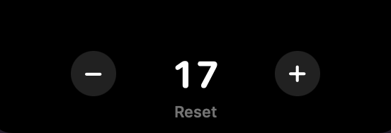
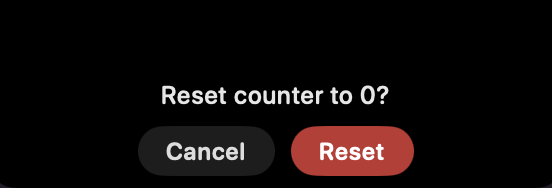

<p align="center">
  
</p>

<h1 align="center">Notch Counter</h1>

<p align="center">
  A minimal counter that lives in the MacBook notch.<br>
  Inspired by <a href="https://github.com/TheBoredTeam/boring.notch">TheBoringNotch</a> — but instead of a smiley, it shows a number.
</p>

<p align="center">
  
</p>

Idle, it widens the notch a little to the right and shows the count. It never
reaches below the menu bar, so it can't cover anything in the app underneath.

<p align="center">
  
  &nbsp;&nbsp;
  
</p>

Hover it and it springs open into `−  count  +`. **Reset** asks before it clears.

- Count survives relaunches (`UserDefaults`).
- No Dock icon, no menu bar item, no permissions, no network. ~100 KB.
- Right-click the notch to quit.
- Works on Macs without a notch too — it falls back to a 200×32 strip at the top centre.

## Install

Grab `NotchCounter.zip` from [Releases](../../releases), unzip, and drop
`Notch Counter.app` in `/Applications`.

The app is ad-hoc signed (no paid Apple Developer account), so macOS quarantines
it on first launch. Clear that once:

```bash
xattr -dr com.apple.quarantine "/Applications/Notch Counter.app"
```

Or launch it, let Gatekeeper refuse, then go to **System Settings → Privacy &
Security → Open Anyway**.

Nothing appears in the Dock when it launches — the number just shows up next to
the notch. To start it at login: **System Settings → General → Login Items → +**.

## Build

Requires Xcode 15+ / Swift 5.9+, macOS 14+.

```bash
git clone https://github.com/ArnavBorkar/notch-counter.git
cd notch-counter
./build-app.sh
open "dist/Notch Counter.app"
```

`build-app.sh` compiles, generates the icon, assembles the `.app`, ad-hoc signs
it, and writes `dist/NotchCounter.zip` for sharing.

## How it works

| File | What it does |
| --- | --- |
| [`Geometry.swift`](Sources/NotchCounter/Geometry.swift) | Reads the real notch bounds from `NSScreen.auxiliaryTopLeftArea` / `auxiliaryTopRightArea`, and lays out the idle and hovered shapes. |
| [`NotchShape.swift`](Sources/NotchCounter/NotchShape.swift) | The silhouette — concave shoulders on top, rounded corners below. |
| [`NotchView.swift`](Sources/NotchCounter/NotchView.swift) | SwiftUI: the number, the `− / +` buttons, the reset confirmation. |
| [`NotchWindow.swift`](Sources/NotchCounter/NotchWindow.swift) | A borderless non-activating `NSPanel` pinned above the menu bar level. |
| [`Tools/make-icon.swift`](Tools/make-icon.swift) | Draws `AppIcon.icns` from scratch with Core Graphics. |

Two details that matter:

**Clicks pass through.** The panel is as large as the *expanded* state at all
times, so `PassthroughContainer.hitTest` returns `nil` for anything outside the
currently visible shape. The rest of your menu bar keeps working normally.

**Hover is polled, not tracked.** An 80 ms poll of `NSEvent.mouseLocation` beats
`NSTrackingArea` here: it works no matter which app is focused, and it doesn't
flicker when the window resizes under the pointer.

## Tweaks

In [`Geometry.swift`](Sources/NotchCounter/Geometry.swift):

- `tail` — how far the idle shape reaches past the right of the notch (46pt).
- `openSize` — size of the hovered panel.

## License

MIT — see [LICENSE](LICENSE).
